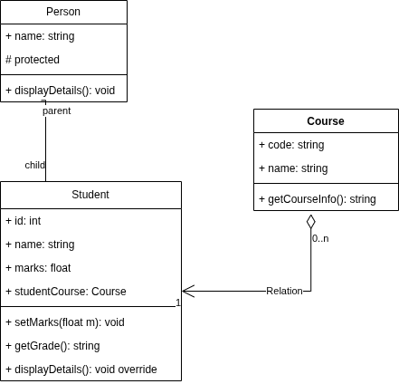
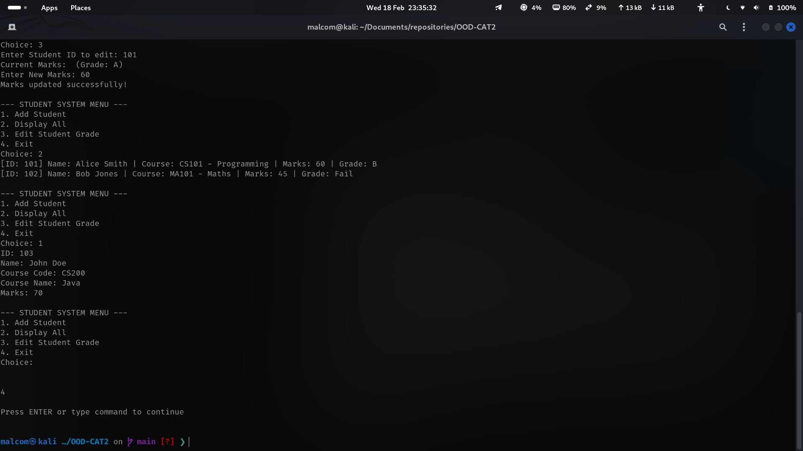
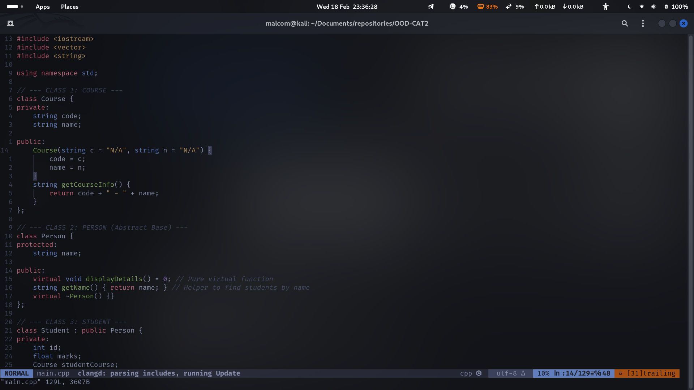
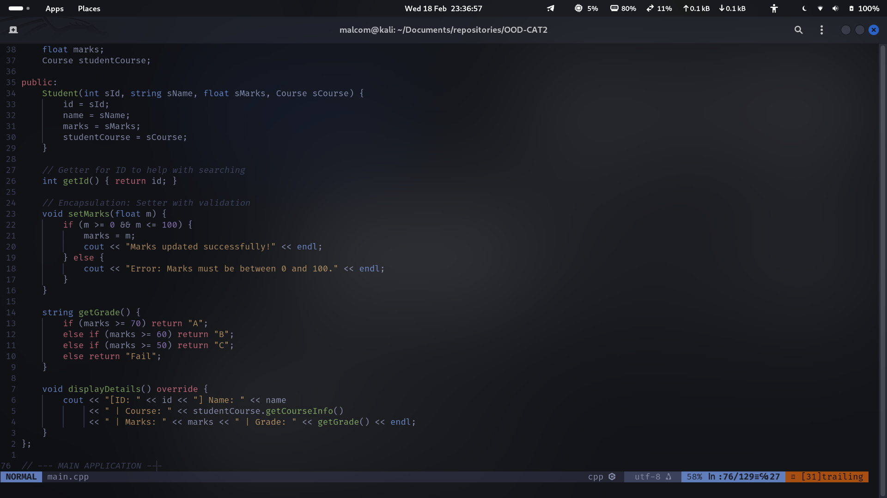
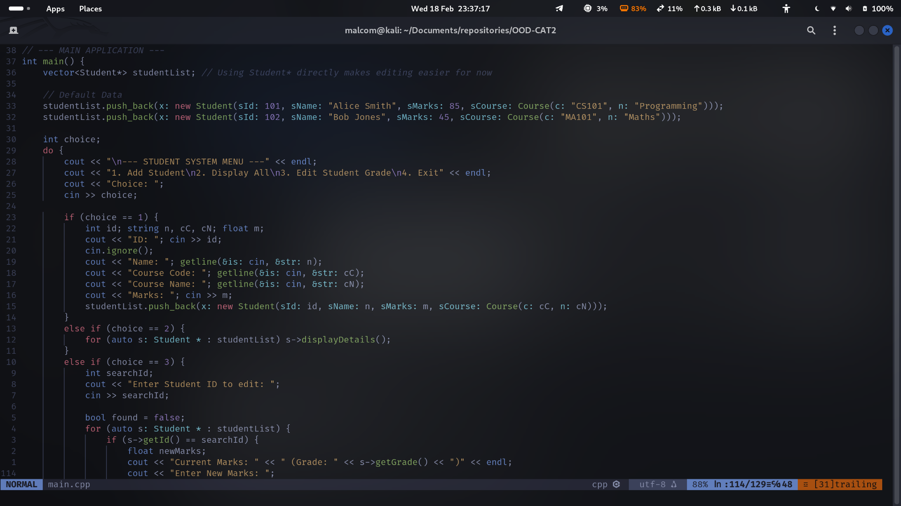
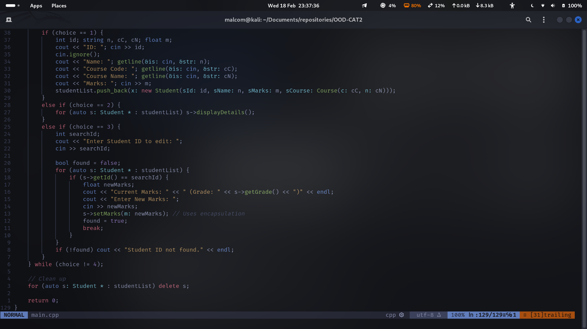

# Object Oriented Design Methods CAT 2
## Design and Implementation of a Simple Object-Oriented Student Management System

---

## 🛠 Project Structure
Based on the current repository organization:
* **`main.cpp`**: The primary source code containing all class definitions and the application logic.
* **`main`**: The compiled executable file.
* **`images/`**: Contains visual documentation of the code, output, and design diagrams.
    * `UML_OOD_CAT2.drawio.png`: Visual representation of class relationships.
    * `output_sample.png`: Screenshot showing the program running.
    * `code_01.png` - `code_04.png`: Snippets of key implementation logic.

---

## 📐 Design & OOP Concepts

### 1. Abstraction
The system uses an **Abstract Base Class** called `Person`. 
* **Implementation:** It contains a pure virtual function `virtual void displayDetails() = 0;`.
* **Purpose:** This ensures that a generic `Person` cannot be instantiated. It acts as a strict blueprint for any specific type of person (like a Student) added to the system later.

### 2. Inheritance
The `Student` class inherits from the `Person` class.
* **Relationship:** **Student IS-A Person**.
* **Implementation:** `class Student : public Person`. It inherits the `name` attribute, allowing for code reuse and a logical hierarchy.

### 3. Encapsulation
Data protection is handled by keeping sensitive attributes `private` or `protected`.
* **Implementation:** Attributes like `marks` and `id` are private. 
* **Validation:** Access is provided through public setters like `setMarks(float m)`. This method includes logic to prevent invalid data (e.g., marks below 0 or above 100) from entering the system.

### 4. Polymorphism
The system demonstrates **Runtime Polymorphism**.
* **Implementation:** The `main` function stores `Student` objects within a `vector<Person*>`.
* **Mechanism:** When iterating through the list, calling `->displayDetails()` triggers the specific `Student` implementation rather than the base class at runtime.

### 5. Composition
A **"Has-A"** relationship is established between the `Student` and the `Course`.
* **Implementation:** Each `Student` object contains a `Course` object as a private member variable. This modular approach separates academic course data from personal student data.

---

## 📊 UML Design
The following diagram illustrates the architecture of the system:



---

## 💻 Features & Usage
The program provides an interactive menu for the user:
1. **Add Student**: Captures Name, ID, Course Details, and Marks.
2. **Display All**: Shows a formatted list of all students, their calculated grades, and course info.
3. **Edit Student Grade**: Allows the user to search for a student by ID and update their marks safely using encapsulated setters.
4. **Exit**: Cleans up allocated memory and closes the program.

### Sample Output


---

## 📂 Implementation Details
Below are snapshots of the core logic:

| Class Logic | Data Management |
| :--- | :--- |
|  |  |
|  |  |

---

## 🚀 How to Run
1. Open your terminal in the project directory.
2. Compile the code:
   ```bash
   g++ main.cpp -o main
